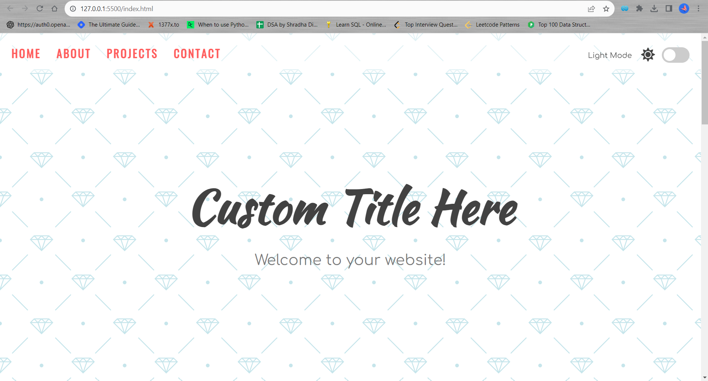

# Dark Mode and Light Mode Implementation

This repository demonstrates how to implement Dark Mode and Light Mode in a web project. Users can switch between two different color schemes for enhanced readability and a better user experience.

## Introduction

Dark Mode and Light Mode have become popular features in modern web design. They allow users to choose a color scheme that suits their preference and environment. This repository provides a step-by-step guide to implementing both modes in your web projects.

## Demo

Check out the [live demo](https://bahalahmad.github.io/light_dark_mode/) to see Dark Mode and Light Mode in action.

## Getting Started

To get started with this implementation in your project, follow these steps:

1. Clone this repository: `git clone https://github.com/bahalahmad/light_dark_mode.git`
2. Navigate to the repository: `cd your repo
3. Open the `index.html` file in your preferred web browser.
